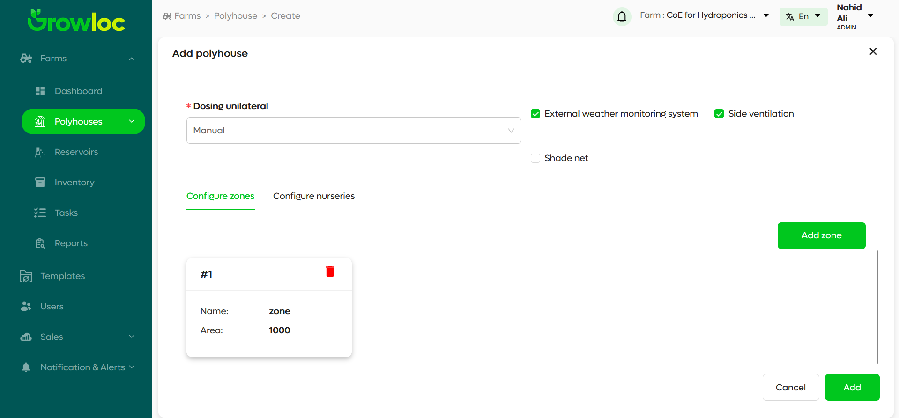

# Add Polyhouse Page

## Introduction

The **Add Polyhouse Page** is designed for adding a single polyhouse to your farm. It provides all the necessary tools to configure the polyhouse, along with its zones and nurseries, ensuring seamless integration into your farm. Users can define multiple zones and nurseries within a single polyhouse.

---

## Features

1. **Add a Single Polyhouse**:

   - Users can add only one polyhouse at a time via the **Add Polyhouse** button on the Polyhouse Page.
   - After clicking the button, users are redirected to this page to provide detailed polyhouse information and configurations.

2. **Zone Configuration**:

   - Add multiple zones within the polyhouse.
   - Each zone is managed as a card with specific details.
   - Zones can be added or removed dynamically.

3. **Nursery Configuration**:

   - Add multiple nurseries within the polyhouse.
   - Each nursery is managed as a card with detailed input fields.
   - Users can add or delete nursery cards as needed.

4. **Validation**:

   - Fields in each section are validated for correctness and completeness.
   - Errors are highlighted for user correction.

5. **Navigation Controls**:
   - **Back**: Returns to the previous step.
   - **Create**: Finalizes the configuration and saves the polyhouse, including its zones and nurseries.

---

## Step-by-Step Instructions

### Step 1: Add Polyhouse Details

1. Click on the **Add Polyhouse** button from the Polyhouse Page to access the Add Polyhouse Page.
2. Fill in the mandatory fields for the polyhouse:
   - Name of the polyhouse.
   - Location (either enter manually or use the **Locate** button to pinpoint on the map).
3. Use the **Cancel** button to exit without saving or **Next** to proceed to Zone Configuration.

---

### Step 2: Configure Zones

1. Add zones to your polyhouse:
   - Click on **Add Zone** to create a new zone card.
   - Each zone card includes fields such as zone name, dimensions, and description.
2. To delete a zone, click the **Delete** icon on the top-right of the zone card.
3. All fields in a zone card must be completed before proceeding.
4. Use the **Back** button to return to the previous step or **Next** to proceed to Nursery Configuration.

- **Zone Configuration Interface**
  

- **Adding a New Zone**  
  

---

### Step 3: Configure Nurseries

1. Add nurseries to your polyhouse:
   - Click on **Add Nursery** to create a new nursery card.
   - Each nursery card includes fields like nursery name, capacity, and description.
2. To delete a nursery, click the **Delete** icon on the top-right of the nursery card.
3. All fields in a nursery card must be completed before proceeding.
4. Use the **Back** button to return to Zone Configuration or **Create** to finalize and save the polyhouse.

#### Screenshots:

- **Nursery Configuration Interface**  
  

- **Adding a New Nursery**  
  

---

## Error Handling

- Validation errors for incomplete or incorrect fields are displayed prominently above the form.
- Fields with unresolved issues are highlighted in red for clarity.
- Correcting the errors enables users to proceed to the next step or finalize the process.

---

## Troubleshooting

1. **I cannot proceed to the next step:**

   - Ensure all mandatory fields are filled and validated.
   - Check for errors displayed above the form or highlighted in red.

2. **Fields are not saving correctly:**

   - Verify that all input fields meet the required format and constraints.
   - Refresh the page if issues persist and retry.

3. **I need to add another polyhouse:**
   - Return to the Polyhouse Page and click the **Add Polyhouse** button again to start adding a new polyhouse.

---
