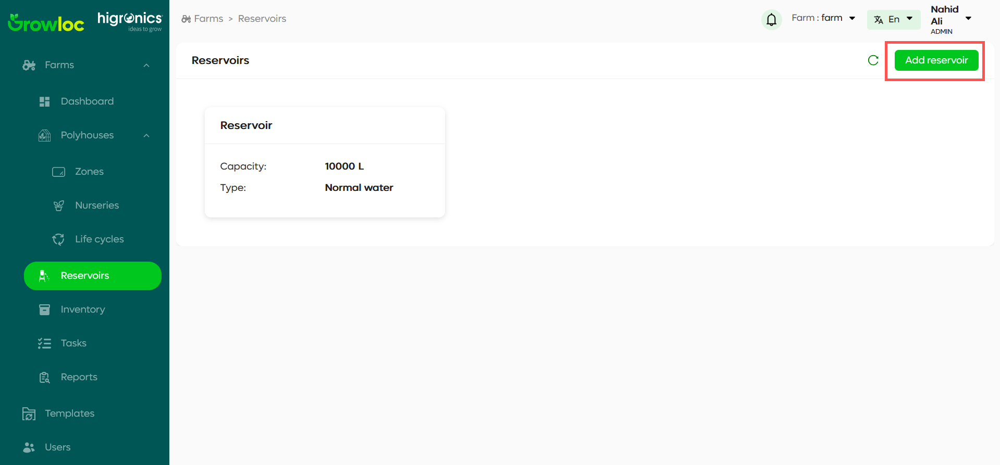

# Add Reservoir Page

## Introduction

The **Add Reservoir Page** allows users to add a single reservoir at a time for their farm. It requires users to provide essential details such as name, capacity, and type. The available reservoir types include Normal water, Ph up, Ph down, and Nutrient. The page ensures the user-friendly addition of new reservoirs with clear instructions and navigation options.

## Features

- **Single Reservoir Setup**: Add one reservoir at a time.
- **Flexible Reservoir Types**: Choose from different reservoir types: Normal water, Ph up, Ph down, Nutrient.
- **Validation Feedback**: Provides validation messages for missing or incorrect fields.
- **Navigation and Buttons**: **Cancel** to return to the Reservoir Page, and **Add** to save and add the new reservoir.

## Step-by-Step Instructions

### Navigating to the Add Reservoir Page

1. To access the **Add Reservoir Page**, go to the **Reservoir Page**.
2. Click the **Add Reservoir** button located in the upper-right corner of the Reservoir Page.

### Adding a New Reservoir

1. On the **Add Reservoir Page**, fill in the required fields:
   - **Name**: Enter a name for the reservoir.
   - **Capacity**: Specify the storage capacity in liters.
   - **Type**: Select one of the following reservoir types:
     - Normal water
     - Ph up
     - Ph down
     - Nutrient
2. Once the fields are filled, you can proceed to add the reservoir.
3. Click **Add** to save the reservoir and return to the **Reservoir Page**. A confirmation will appear once the reservoir is added.

   

### Canceling the Process

1. If you decide not to add a reservoir, click **Cancel**. This will return you to the **Reservoir Page** without saving any changes.

   

## Error Handling

### Missing or Invalid Fields

- **Issue**: You cannot proceed because a field is missing or invalid.
- **Solution**: Ensure that all required fields are filled correctly. Invalid or incomplete fields will be highlighted, and validation messages will guide you to correct them.

### Duplicate Reservoir Name

- **Issue**: The name of the reservoir does not need to be unique, so no error will occur if the same name is entered.

## Troubleshooting

### Unable to Save the Reservoir

- **Issue**: Clicking **Add** does not save the reservoir.
- **Solution**: Check if all fields are correctly filled. Any invalid or missing field will prevent you from proceeding. Correct the errors and try again.

### Navigating Away Without Saving

- **Issue**: Data is lost when navigating away from the page.
- **Solution**: Ensure that you click **Add** to save the reservoir before navigating away. Clicking **Cancel** will discard any unsaved changes.

---

**Note**: After adding a new reservoir, you will be redirected to the **Reservoir Page**, where the new reservoir will be listed.
