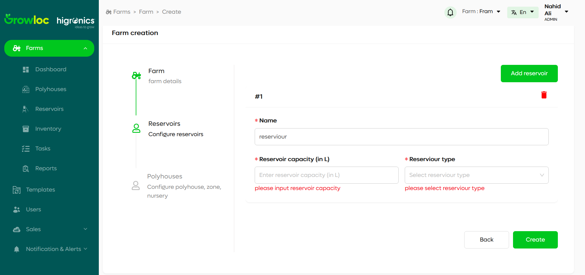

# Add Farm Page

The **Add Farm Page** helps you add a new farm to the system, along with its location, reservoirs, and polyhouses. This page is easy to use and allows workers to provide all the necessary details about the farm in a step-by-step process.

---

## How to Access the Add Farm Page?

1. Go to the **Farm Page**.
2. Click the **Add Farm** button in the top-right corner.

---

## Purpose of the Add Farm Page

The Add Farm Page is designed to:

- Add a new farm and its details.
- Specify the farm’s location.
- Optionally add reservoirs and polyhouses while creating the farm.

---

## Step 1: Add Farm Details

1. **Enter Farm Details**:
   - Provide the farm's name, area, nutrient type, and other required information.
   - All fields are mandatory.

2. **Set Farm Location**:
   - You can type the address, and suggestions will appear based on Google Maps.
   - Alternatively, click the **Locate** button to find the farm's exact pin point location on a map.

3. **Buttons**:
   - **Next**: Proceeds to the next step after all fields are filled correctly.
   - **Cancel**: Returns to the **Farm Page** without saving any data.

4. **Validation**:
   - If any field is left blank or contains incorrect information, you’ll see an error message.
   - Fields with errors are highlighted in red with a message explaining the problem.

---

## Step 2: Configure Reservoirs

1. **Add Reservoirs**:
   - You can add one or more reservoirs to the farm.
   - Each reservoir is displayed as a numbered card (e.g., #1, #2, etc.).
   - Click the **Add Reservoir** button to create a new reservoir card.
   - To delete a reservoir, click the delete icon in the top-right corner of the reservoir card.

2. **Mandatory Fields**:

   - If any field in a reservoir card is filled, all fields in that card become mandatory.
   - If fields are left incomplete, the system will display error messages for the specific fields, and they will be highlighted in red.

3. **Buttons**:

   - **Back**: Returns to the **Farm Details** step, allowing you to make changes.
   - **Create**: Saves the farm with the reservoirs. You can skip adding reservoirs if no data is entered.

4. **Validation**:

   - **Field Validation Errors**:

     - If any field in a reservoir card is incomplete or invalid, the specific field will be highlighted in red.
     - A message will appear below the field, explaining the issue.

   

   - **Other Errors**:

     - If an error occurs that is not specific to field validation, a banner will appear above all steps within the farm creation card.
     - The banner will display the error message for easy identification.

     

5. **Successful Creation**:

   - Once all fields are validated, clicking **Create** will successfully save the farm and move to the **Configure Polyhouses** step.
   - A confirmation popup will appear, confirming that the farm has been created.

---

## Step 3: Configure Polyhouses

1. **Add Polyhouses**:

   - You can add one or more polyhouses to the farm.
   - Each polyhouse is displayed as a numbered card (e.g., #1, #2, etc.).
   - Click the **Add Polyhouse** button to add a new card.
   - To delete a polyhouse, click the delete icon in the top-right corner of the card

     [Add polyhouse](./farmAttachment/addPolyhouse.png)

2. **Configure Zone**:

   - **Add Zone**:

     - Click the **Add Zone** button to open the Add Zone modal.
     - Fill in the required fields and click **Add**.
     - A new Zone card will appear.

       

       

   - **Edit Zone**:

     - Click on an existing Zone card to open the modal pre-filled with its details.
     - Update the information and click **Update** to save.

       

   - **Delete Zone**:
     - Click the delete icon on the Zone card to remove it.

3. **Configure Nursery**:

   - **Add Nursery**:

     - Click the **Add Nursery** button to open the Add Nursery modal.
     - Fill in the required fields and click **Add**.
     - A new Nursery card will appear.

       

       

   - **Edit Nursery**:

     - Click on an existing Nursery card to open the modal pre-filled with its details.
     - Update the information and click **Update** to save.

     

   - **Delete Nursery**:
     - Click the delete icon on the Nursery card to remove it.

4. **Validation**:

   - Fields with errors are highlighted in red with messages explaining the issue.
   - Cards with unresolved errors are marked in red. Clicking the card opens the modal to fix the errors.

     

     

5. **Navigation**:

   - **Cancel**: Skips the Polyhouse step and moves to the next process.
   - **Add**: Saves the polyhouse details and allows adding multiple polyhouses.

6. **Successful Completion**:
   - After completing all fields and validations, the system proceeds to finalize the farm.

---

## Troubleshooting

- **Problem**: Unable to add a polyhouse.  
  **Solution**: Check if all fields are filled correctly in the active polyhouse card. Errors will be highlighted in red.

- **Problem**: Polyhouse tab shows validation errors.  
  **Solution**: Complete all mandatory fields in the Configure Zone or Configure Nursery tabs.

- **Problem**: Unable to proceed to the next step.  
  **Solution**: Fix the errors shown above the step and ensure all polyhouse cards are completed properly.

- **Problem**: Unable to add a zone or nursery.  
  **Solution**: Ensure all fields in the modal are filled correctly. Errors are highlighted in red.

- **Problem**: Validation errors in Polyhouse steps.  
  **Solution**: Review cards and modals for highlighted fields, and resolve any errors.

- **Problem**: Unable to proceed to the next step.  
  **Solution**: Fix the errors displayed above the step or in specific cards and modals.
