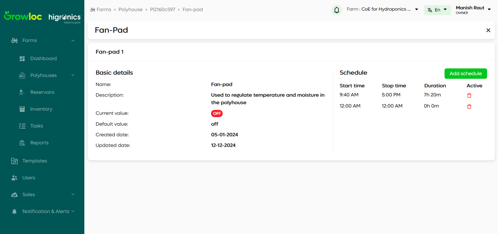
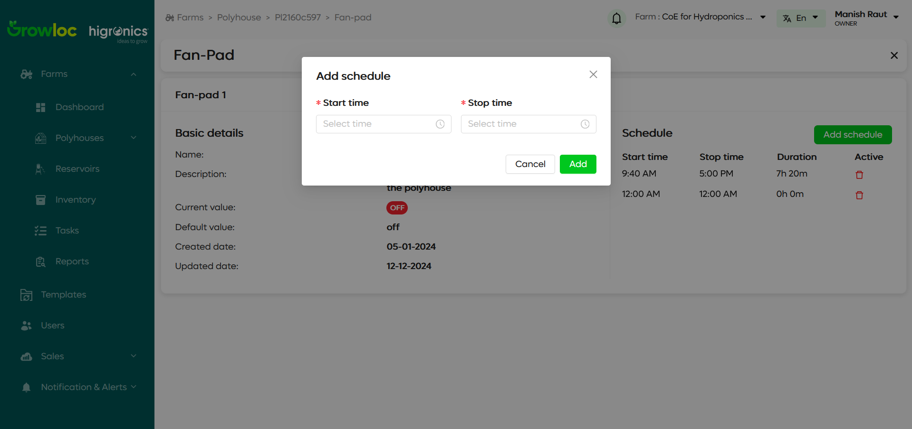

# Component Details Page

The **Component Details Page** allows users to manage and view detailed information about the components within a polyhouse, such as fans, pumps, or other mechanical devices. It provides insights into the component's functionality and allows users to manage schedules for optimal operation.

## Features

1. **Component Information**:
   - Displays key details of the selected component (e.g., **Fan-Pad**, **Cooling System**, etc.).
2. **Schedule Management**:
   - **Schedule Table**: Shows the component's schedules with the following columns:
     - **Start Time**: The time when the component starts.
     - **Stop Time**: The time when the component stops.
     - **Duration**: The total duration for which the component will run.
     - **Active**: Indicates whether the schedule is active or not (Red bin icon can be used to delete the schedule).
3. **Add New Schedule**:

   - **Add Schedule Modal**: Allows users to add new schedules by specifying the start time, stop time, and duration.

4. **CRUD Operations**:
   - **Edit Schedule**: Users can edit the start time and stop time directly by clicking on the corresponding field in the schedule table.
   - **Delete Schedule**: The schedule can be deleted using the red dustbin icon in the **Active** column.
   - **Create New Schedule**: Users can add new schedules through the modal.

## Step-by-Step Instructions

### Accessing Component Details

1. Navigate to the **Polyhouse Details Page**.
2. Click on a component (e.g., **Fan-Pad**) to open its details page.

### Managing Component Schedules

1. The **Schedule Table** displays existing schedules for the selected component, with columns like **Start Time**, **Stop Time**, **Duration**, and **Active**.

2. To **edit** a schedule, click on the **Start Time** or **Stop Time** field and modify the time.

3. To **delete** a schedule, click on the **Red Dustbin Icon** in the **Active** column.

4. To **add a new schedule**, click the **Add Schedule** button to open the **Add Schedule Modal**.

   - Enter the **Start Time**, **Stop Time**, and **Duration** for the schedule.
   - Click **Save** to create the schedule.

    <!-- Add your screenshot here -->

### Troubleshooting

- **Issue**: Unable to edit schedule times.

  - **Solution**: Ensure the correct time format is used when editing. If the issue persists, refresh the page.

- **Issue**: New schedule is not saved.
  - **Solution**: Check for validation errors in the modal, ensuring all fields are filled correctly. If the issue persists, try refreshing the page or contact support.

---
