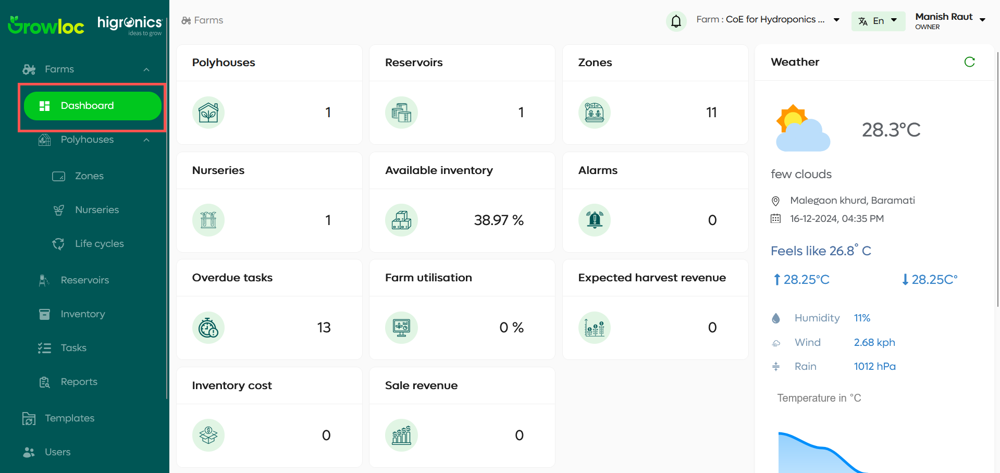
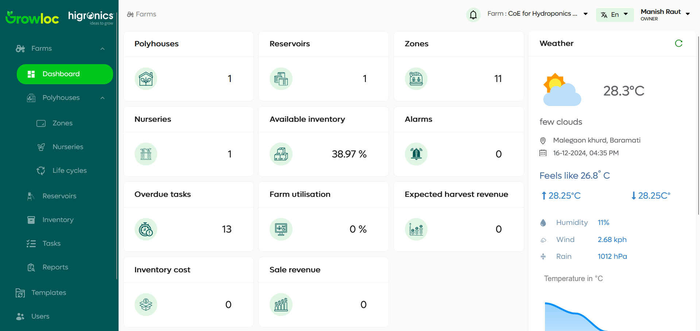
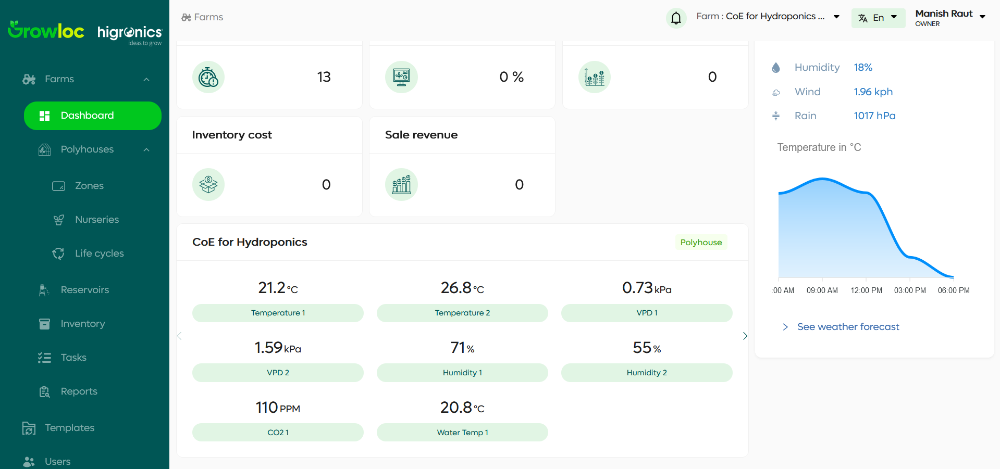

# Dashboard Page Documentation

## Introduction

The **Dashboard** page provides a comprehensive overview of the farm's key metrics and real-time data. It consists of three primary sections:

1. **General Information** – Displays various farm statistics and metrics.
2. **Weather** – Shows real-time weather conditions and a 7-day forecast.
3. **Sensor Details Carousel** – Presents data from sensors across the farm’s various sections (Polyhouses, Zones, and Nurseries).

This page helps users stay updated with the farm's operational status and environmental conditions at a glance.

## Features

### 1. General Information

The general information section displays key metrics about the farm, including:

- **Farm Overview**: Displays the farm’s current status (number of polyhouses, zones, etc.)
- **Inventory and Revenue**: Displays the inventory cost and sale revenue.
- **Task Overview**: Displays overdue tasks and their status.
- **Expected Harvest Revenue**: Provides an estimate of the expected revenue from harvests.

### 2. Weather

This section is dedicated to providing real-time weather information for the farm, including:

- **Current Weather Conditions**: Displays temperature, humidity, wind speed, and rainfall.
- **Weather Forecast**: A graphical view of the forecast for the next 7 days, showing the temperature throughout the day and a detailed weather report with parameters like wind speed and air pressure.

### 3. Sensor Details Carousel

The sensor details carousel displays real-time sensor data for different sections of the farm:

- **Polyhouse**: Shows sensor data (e.g., temperature, humidity, CO2 levels) specific to the polyhouse.
- **Zones**: Displays sensor readings for individual zones within the farm.
- **Nurseries**: Displays sensor data for nurseries across the farm.
- **Auto-scrolling**: The carousel automatically scrolls through the data of each section, giving users an easy view of the farm’s environment.

Each sensor card includes:

- **Current Sensor Value**: The real-time data for each sensor (e.g., temperature, humidity).
- **Section Tag**: Indicates whether the data is from the polyhouse, zone, or nursery.

## Step-by-Step Instructions

### 1. Navigating to the Dashboard Page

- The **Dashboard** page can be accessed from the sidebar by clicking on the **Dashboard** button. It is the main entry point to view live data and key farm metrics.

### 2. Viewing Farm Metrics

- On the left side of the dashboard, you can see the various metrics like **Inventory cost**, **Sale revenue**, **Overdue tasks**, and more. These are updated in real-time and give an overview of the farm’s performance.

### 3. Weather Forecast

- The weather section provides the **current weather** in the farm's location along with a **7-day forecast**. To access detailed weather insights, click on **See weather forecast**, which will redirect to a more comprehensive weather report.

### 4. Sensor Data Carousel

- The sensor carousel automatically scrolls through different sections of the farm.
- You can manually navigate through the data by using arrows or pause the auto-scroll feature.

### 5. Interactive Sections

- Each sensor card includes real-time data. The cards are organized into categories (Polyhouse, Zones, Nurseries) and can be identified by tags (e.g., **Polyhouse**, **Zone**, **Nursery**).

## Troubleshooting

### Sensor Data Not Displaying

- If no data is displayed in any of the sensor cards, ensure that the sensors are properly connected and transmitting data. You may need to check the sensor configurations.

### Weather Data Not Loading

- If the weather data is not showing, confirm that your internet connection is active, as the data is pulled from a remote weather service. If issues persist, contact support for further assistance.
