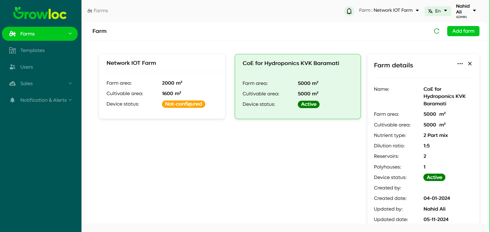
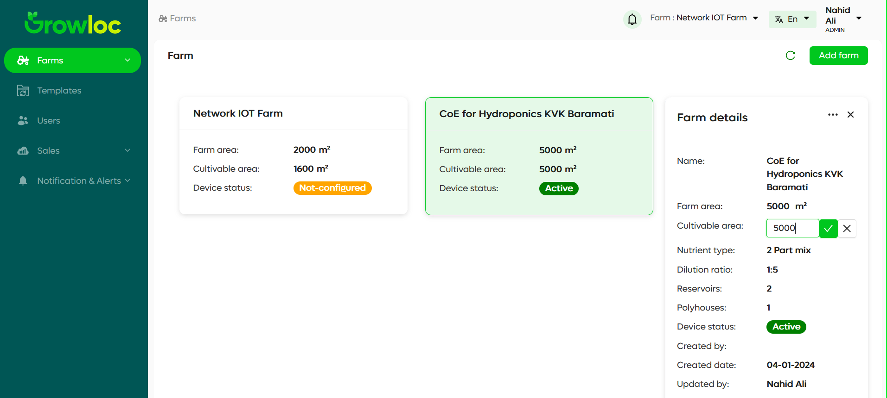
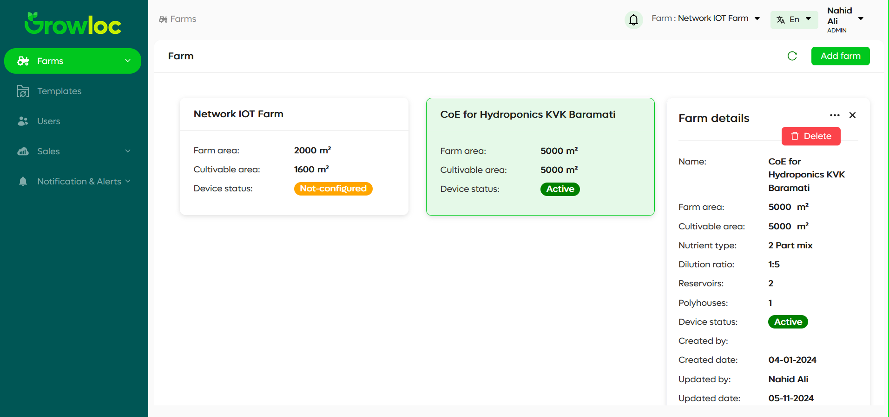

# Farm Page

Welcome to the Farm Page! This section of the Farm ERP application helps you manage and view details of farms efficiently.

---

## Introduction

The **Farm Page** displays all farms in a card format. Each card shows key details like the farm's name, area, and device status. When you click on a card, a sidebar opens to show additional details about the selected farm.

This page is designed for farmers and farm workers, providing a simple and user-friendly way to manage farm data.

---

## Features

1. **Farm Cards**:

   - Display the farm's **name**, **farm area**, **cultivable area**, and **device status**.
   - A visual representation makes it easy to browse through farms.

2. **Sidebar Details**:

   - View detailed information about the farm, including:
     - Nutrient Type
     - Dilution Ratio
     - Number of Reservoirs and Polyhouses
     - Created and Updated Details
   - Edit specific fields (e.g., Name, Farm Area, Cultivable Area, Nutrient Type, Dilution Ratio).

3. **Farm Deletion**:

   - Use the three-dot menu on the sidebar to delete a farm.

4. **Editable Fields**:
   - Make changes to fields directly and save or cancel edits.

---

## Step-by-Step Instructions

### Viewing Farms

1. Open the **Farm Page**.
2. Each farm appears as a card with essential details.
   - **Example**:
     - Name: `Network IoT Farm`
     - Farm Area: `2000 m²`
     - Device Status: `Not-configured`

### Accessing Farm Details

1. Click on a farm card to open the **details sidebar**.
2. The sidebar displays all relevant details for that farm.
   

### Editing Farm Details

1. Click on the value you want to edit (e.g., Farm Area).
2. An input box appears with two buttons:
   - **✔**: Saves the updated data.
   - **✖**: Cancels the edit and reverts to the original data.
     

### Deleting a Farm

1. Open the sidebar for a specific farm.
2. Click the **three-dot menu** in the upper-right corner.
3. Select the **Delete** option.
4. Confirm deletion to remove the farm permanently.
   

### Closing the Sidebar

- Click the **Close (X)** button at the top-right of the sidebar.

---

## Troubleshooting

### Issue: Unable to Edit Farm Details

- **Solution**: Ensure you click directly on the field value to make it editable.
- **Tip**: If the input box doesn’t appear, refresh the page and try again.

### Issue: Sidebar Not Closing

- **Solution**: Check for any unsaved edits and click the **Close (X)** button.

### Issue: Farm Not Deleting

- **Solution**:
  - Confirm that you’ve selected the correct farm.
  - Ensure your internet connection is stable.
  - If the issue persists, contact support.

---
