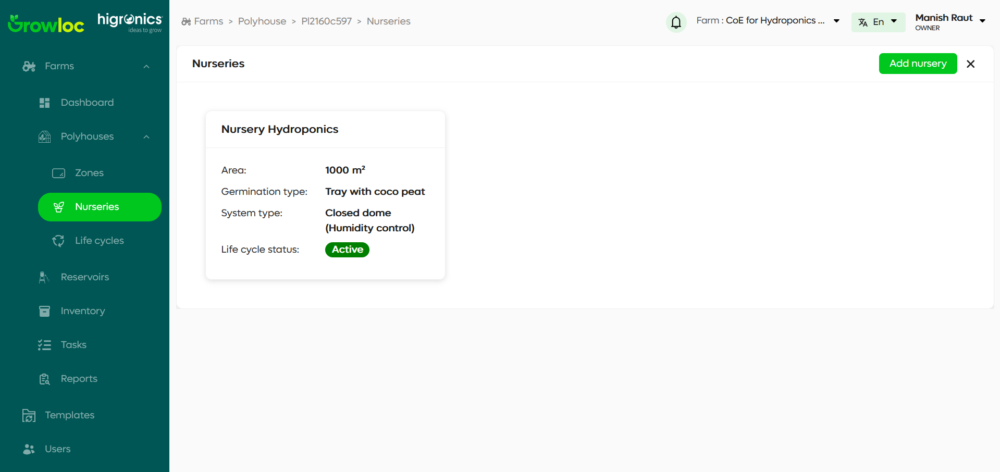
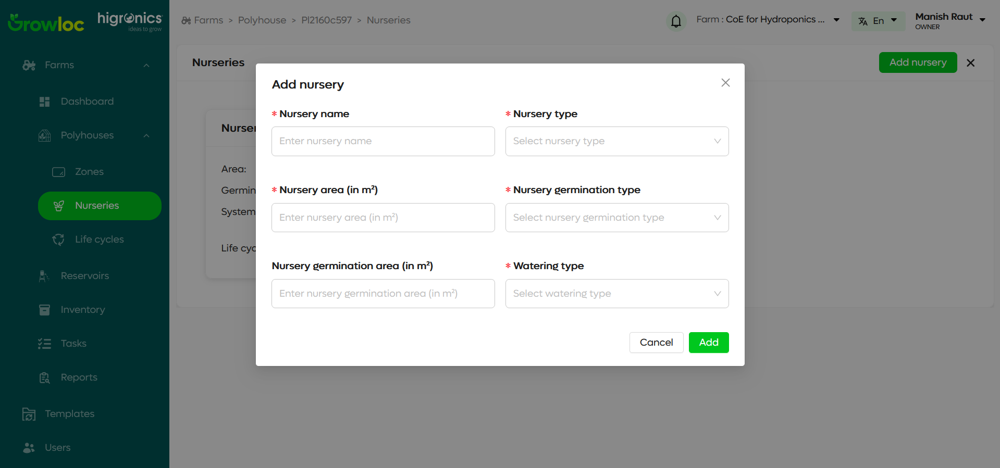
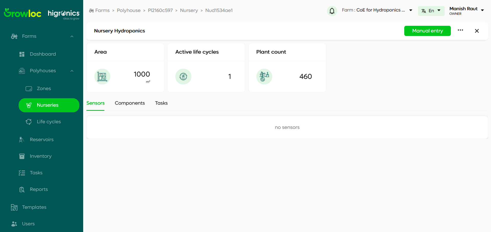
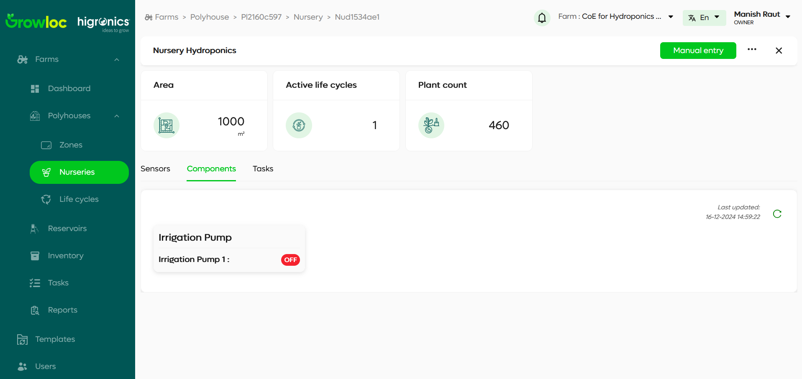
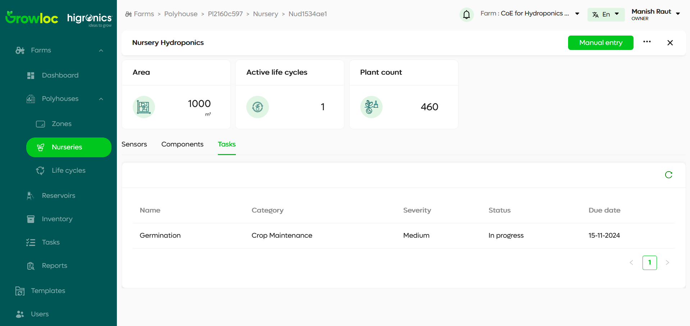
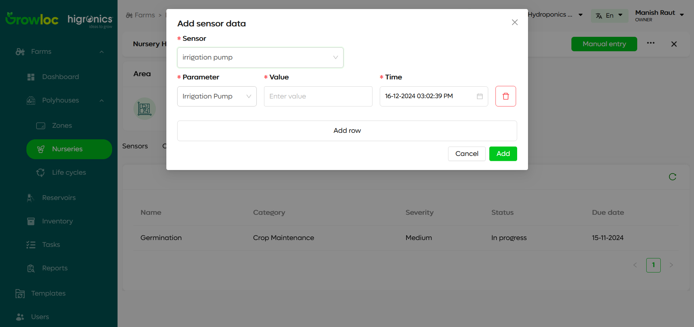
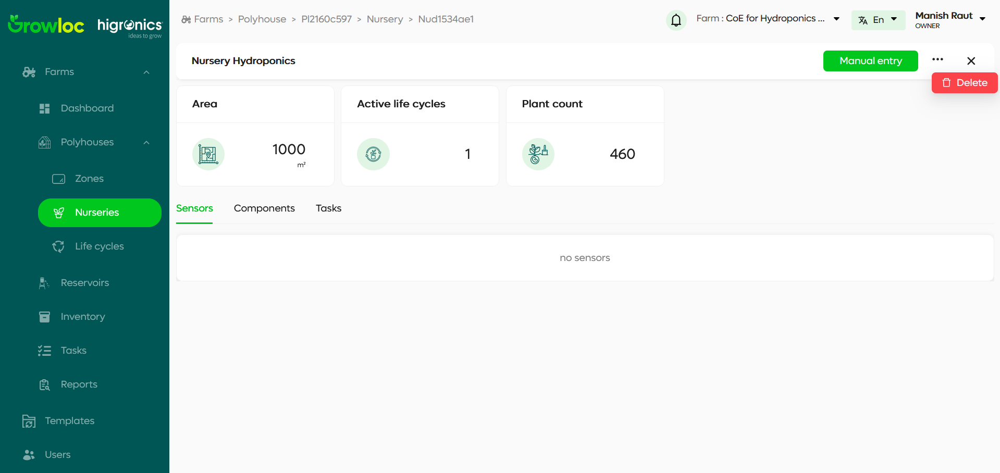

# Nursery Page Documentation

The **Nursery Page** provides a comprehensive interface for managing nurseries within a farm. Nurseries are specialized areas where plants are grown from seeds until they are ready to be transferred to the main farm areas. This page allows users to view, add, and manage nurseries in a card view and navigate to detailed pages for each nursery to access advanced features.

---

## Introduction

Nurseries play a vital role in the early stages of plant growth. The **Nursery Page** offers an intuitive UI for nursery management, enabling users to:

- View all nurseries in a card format.
- Access detailed information and tabs for sensors, components, and tasks.
- Manually update data when necessary.
- Perform CRUD operations like deleting nurseries.

---

## Features

### 1. Nursery Overview (Card View)

- Displays nurseries in a card layout for a quick summary.
- Each card includes:
  - Nursery Name (e.g., **Seedling Nursery**).
  - Nursery Area (e.g., **100 m²**).
  - Germination Type (e.g., **Seedling**, **Cuttings**).
  - System Type (e.g., **Hydroponic**, **Soil-Based**).
  - Life Cycle Status (e.g., **Active**, **Inactive**).

### 2. Add Nursery

- A prominent **Add Nursery** button allows users to create a new nursery.

### 3. Nursery Details Page

- Accessed by clicking on a nursery card.
- Displays:
  - Nursery information.
  - Three cards containing **Area**, **Active Life Cycles**, and **Plant Count**.
  - Tabs for **Sensors**, **Components**, and **Tasks**.
  - Options for manual data entry.
  - A three-dot menu for additional actions like deleting the nursery.

### 4. Manual Data Entry

- Allows users to update specific metrics manually if automated updates are unavailable.

### 5. Three-Dot Menu Options

- Provides a delete option for removing nurseries.

---

## Step-by-Step Instructions

### 1. Viewing Nurseries

1. Navigate to the **Nursery Page** from the sidebar.
2. View a list of nurseries displayed as cards.
3. Each card displays:
   - Nursery Name
   - Nursery Area
   - Germination Type
   - System Type
   - Life Cycle Status (e.g., Active/Inactive).

### 2. Adding a New Nursery

1. Click the **Add Nursery** button in the top-right corner.
2. Fill in the required fields:
   - Nursery Name
   - Nursery Area
   - Germination Type
   - System Type
     and other details
3. Click **Add** to add the new nursery.
4. The newly created nursery appears in the list.

### 3. Viewing Nursery Details

1. Click on a nursery card to open its **Nursery Details Page**.
2. View detailed metrics:
   - Total Nursery Area
   - Active Life Cycles
   - Plant Count
3. Use the **Sensors**, **Components**, and **Tasks** tabs to manage respective nursery aspects.

**[Insert Screenshot: Nursery Details Page with Active Life Cycles and Plant Count Cards]**

### 4. Managing Sensors

1. Navigate to the **Sensors Tab**.
2. View live data for metrics like:
   - Electrical Conductivity (EC)
   - pH Levels
3. Update sensor data manually if needed using the **Manual Entry** button.

### 5. Managing Components

1. Go to the **Components Tab**.
2. View and modify installed components like irrigation systems, lighting, etc.

### 6. Managing Tasks

1. Open the **Tasks Tab**.
2. Add, update, or delete tasks associated with the nursery.

### 7. Manual Data Entry

1. On the Nursery Details Page, click **Manual Entry**.
2. Input specific values for:
   - Sensor readings
   - Nursery metrics (e.g., Plant Count, Area Utilization)
3. Save the changes to update the nursery information.

### 8. Deleting a Nursery

1. On the Nursery Details Page, click the **three-dot menu** in the top-right corner.
2. Select **Delete Nursery**.
3. Confirm the action to remove the nursery permanently.

---

## Troubleshooting

1. **Unable to Add Nursery**:

   - Verify all required fields are filled.
   - Check for error messages next to invalid fields.

2. **Sensor Data Not Updating**:

   - Ensure sensors are connected and functional.
   - Use the **Manual Entry** option as a temporary measure.

3. **Error in Deleting Nursery**:

   - Check if the nursery is associated with active life cycles or tasks.
   - Resolve dependencies before deletion.

4. **Nursery Details Not Loading**:
   - Refresh the page or ensure stable internet connectivity.

---
