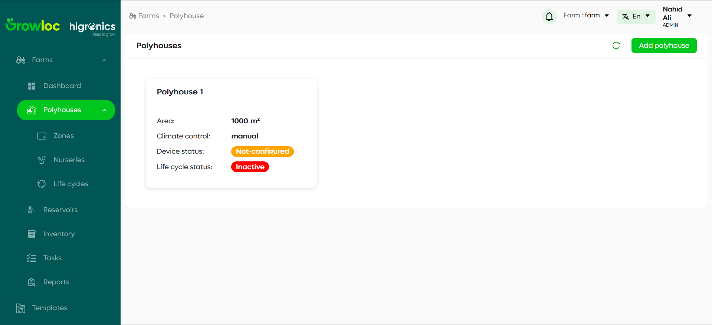
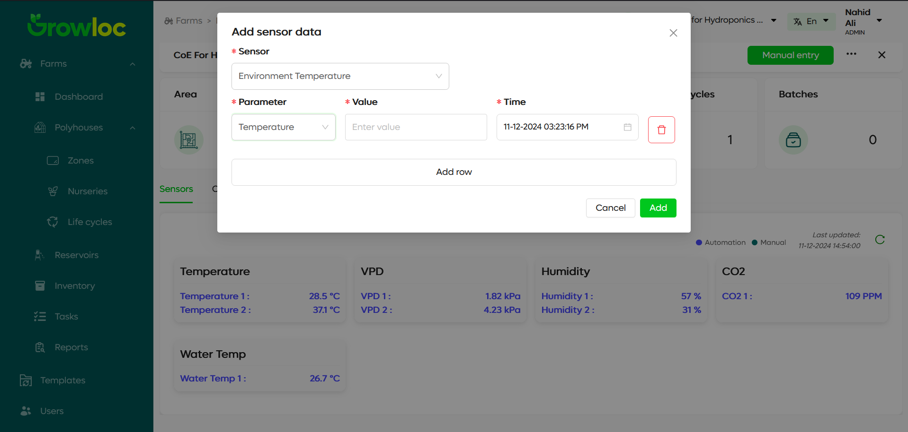
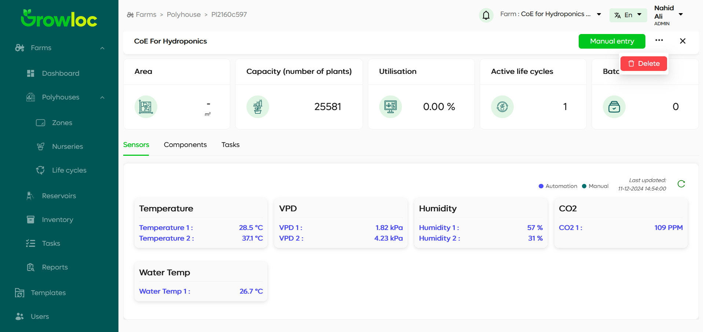

# Polyhouse Page

Welcome to the Polyhouse Page! This section of the Farm ERP application allows you to manage and view details of polyhouses efficiently.

---

## Introduction

The **Polyhouse Page** provides a detailed and user-friendly interface for managing polyhouses. Each polyhouse is displayed in a card view with its key details, making it easy for users to monitor and manage multiple polyhouses at a glance. Additionally, users can manually input sensor data and delete polyhouses when necessary.

This page is designed for farmers and farm workers to streamline polyhouse management and improve operational efficiency.

---

## Features

1. **Polyhouse Cards**:
   - Display essential details for each polyhouse, including:
     - **Area**
     - **Climate Control Status** (manual or automated)
     - **Device Configuration Status**
     - **Life Cycle Status** (active or inactive)

2. **Key Details**:
   - Clicking a card redirects you to the **Polyhouse Details Page**, showing:
     - Sensors configured in the polyhouse.
     - Current climate control settings.
     - Crop lifecycle details.

3. **Manual Sensor Entry**:
   - Add manual sensor data in case of sensor failure or for testing purposes.

4. **Polyhouse Deletion**:
   - Delete a polyhouse using the three-dot menu.

---

## Step-by-Step Instructions

### Viewing Polyhouses

1. Navigate to the **Polyhouse Page**.
2. Each polyhouse appears as a card with the following details:
   - **Area**: Displays the size of the polyhouse.
   - **Climate Control Status**: Indicates whether climate control is manual or automated.
   - **Device Configuration Status**: Displays whether the devices in the polyhouse are configured or not.
   - **Life Cycle Status**: Shows if the polyhouse is active or inactive.

   

### Adding Manual Sensor Data

1. Click the **Manual Entry** button on the polyhouse card.
2. A modal opens, allowing you to manually add sensor data.
   
   

3. **Steps**:
   - **Select Sensor**: Choose a sensor from the available list.
   - **Add Row**: Click to add a new entry row.
   - **Choose Parameter**: Select the parameter you want to enter data for.
   - **Enter Data**: Provide the value and timestamp for the parameter.
   - **Multiple Entries**: Add multiple rows to input more data.

4. **Warnings**:
   - Changing the parameter resets the previously entered data.
   
5. **Usage**:
   - This feature is helpful if a sensor is faulty or if users want to test the connected devices to ensure correct values are being reported.

6. Save the entries to submit the manual data.

### Deleting a Polyhouse

1. Click on the **three-dot menu** beside the Manual Entry button.
   
   

2. Select the **Delete** option.
3. Confirm the action to delete the polyhouse permanently.

### Accessing Additional Polyhouse Details

1. Click on a polyhouse card to open its **Details Page**.
2. View:
   - Sensor configurations.
   - Climate control settings.
   - Crop lifecycle details.

---

## Troubleshooting

### Issue: Unable to Add Manual Sensor Data

- **Solution**: Ensure all required fields (sensor, parameter, value, and timestamp) are filled before saving.
- **Tip**: If warnings appear, address them to proceed.

### Issue: Unable to Delete a Polyhouse

- **Solution**:
   - Confirm that the correct polyhouse is selected.
   - Ensure you have the necessary permissions to delete the polyhouse.
   - If the issue persists, refresh the page or contact support.

### Issue: Details Page Not Opening

- **Solution**: Verify that your internet connection is stable. If the issue persists, try refreshing the page or logging out and back in.

---

The Polyhouse Page is a vital part of the Farm ERP system, helping users effectively manage their polyhouses and handle edge cases like sensor faults or manual testing.
