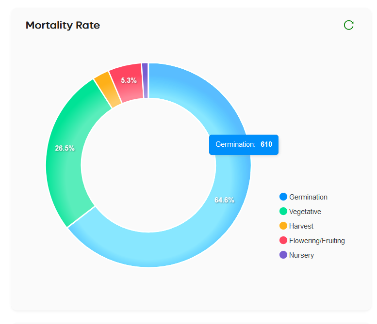

# Reports Page

The **Reports Page** provides detailed insights into crop performance, revenue, inventory, and task management. It includes various graphs and cards designed to give a comprehensive overview of the farm's activities and outcomes.

---

## Features

- **Header Cards**: Displays key metrics such as Expected Harvest Revenue, Inventory Cost, Sale Revenue, Available Inventory, and Farm Utilization.
- **Graphs**: Includes various types of graphs to present detailed data:
  - **Mortality Rate** (Pie Chart)
  - **Harvested Breakup** (Stacked Bar Chart)
  - **Tasks** (Pie Chart)
  - **Batches Harvest** (Stacked Bar Chart)
- **Interactive Tooltips**: Hovering over graphs reveals additional data and insights.
- **Data Refresh**: Each graph includes a refresh icon to update the displayed data.

---

## Step-by-Step Instructions

### 1. **Overview**

The Reports Page consists of multiple sections, including:

- **Header Cards**: These cards show high-level metrics.
- **Graphs**: Visual representations of data, including pie charts and stacked bar charts.

### 2. **Header Cards**

At the top of the page, you'll find the following cards:

- **Expected Harvest Revenue**: Displays the projected revenue from the upcoming harvest.
- **Inventory Cost**: Shows the total cost of inventory on hand.
- **Sale Revenue**: Indicates the total revenue from sales.
- **Available Inventory**: Displays the current inventory available.
- **Farm Utilization**: Shows the utilization rate of the farm.

### 3. **Graphs**

Below the header cards, you'll find four graphs:

#### **Mortality Rate (Pie Chart)**

This pie chart visualizes the mortality rate of crops, divided into sections like **Germination**, **Vegetative**, **Harvest**, and more. Hovering over the pie chart will show a tooltip with the section name and its corresponding count.

#### **Harvested Breakup (Stacked Bar Chart)**

This stacked bar chart shows the breakdown of harvested crops by type. Hovering over the chart will display a tooltip in the form of a card, which includes:

- **Crop Name**: The type of crop.
- **Total Harvested**: The total harvested quantity.
- **Life Cycle Name**: The life cycle phase of the crop.
- **Harvest Quantity**: The harvested amount (in kg or pieces, depending on the unit used).

#### **Tasks (Pie Chart)**

This pie chart shows the task completion status, such as pending, completed, and in-progress tasks. Hovering over the chart will display a tooltip with the task section name and its count.

#### **Batches Harvest (Stacked Bar Chart)**

This chart provides data on the harvested batches. Hovering over the chart will show a tooltip in the form of a card, containing:

- **Batch Name**: The name of the batch.
- **Total Harvested**: The total harvested quantity.
- **Batch Details**: Similar to the Harvested Breakup chart, with the batch name replacing the life cycle name.

### 4. **Data Refresh**

Each graph has a refresh icon in the top-right corner. Clicking this icon will refresh the data displayed on the graph, ensuring you're viewing the most up-to-date information.

---

## Troubleshooting

- **Graphs Not Showing Updated Data**: If graphs are not displaying the most current data, click the refresh icon located in the top-right corner of each graph to reload the data.
- **Incorrect Graph Data**: If any graph is showing inaccurate data, ensure that the data source is updated or check the farm's settings for the most recent information.
- **Tooltips Not Appearing**: If the tooltips are not appearing when hovering over the graphs, ensure your browser supports hover interactions. Try refreshing the page if the issue persists.

---
