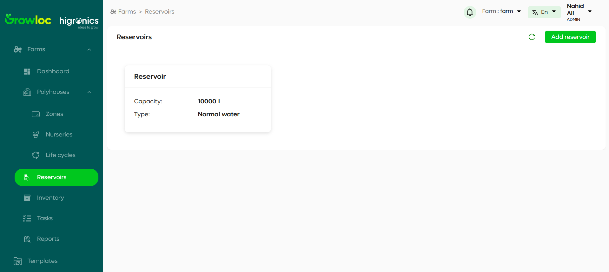
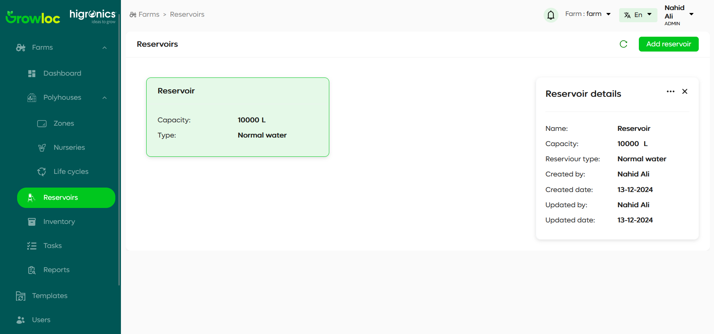
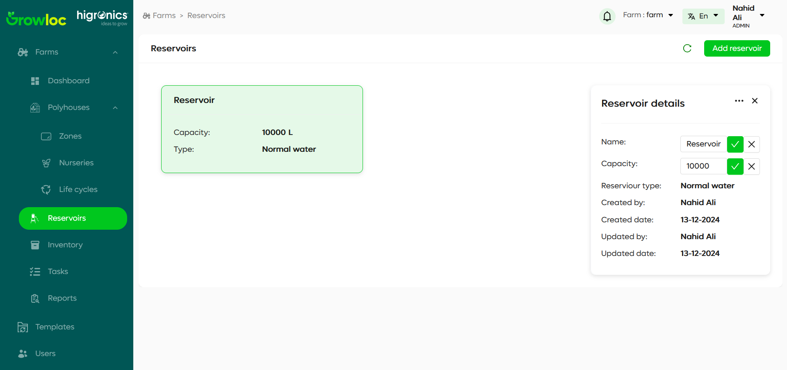
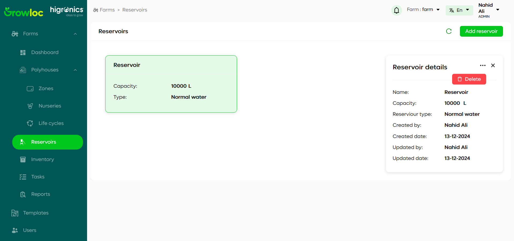
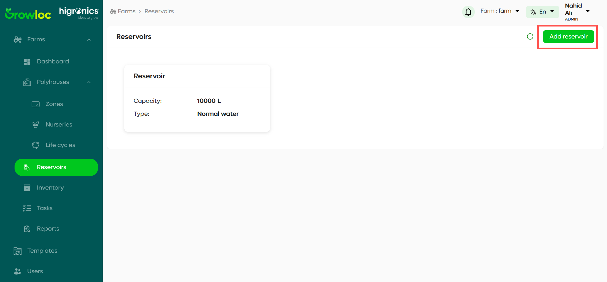

# Reservoir Page

## Introduction

The **Reservoir Page** allows users to manage all reservoirs in their farm. It displays reservoirs in a card view format, where each card provides summarized information about the reservoir. Users can view, edit, or delete reservoirs and quickly navigate to the **Add Reservoir Page** to create new reservoirs.

---

## Features

1. **Reservoir Cards**:

   - Each reservoir is displayed as a card showing key details such as:
     - **Capacity**: Volume of the reservoir (e.g., `10,000 L`).
     - **Type**: Type of reservoir water (e.g., Normal water).
   - Click on a card to open the **Reservoir Details** sidebar.

2. **Reservoir Details Sidebar**:

   - Provides detailed information about the selected reservoir, including:
     - Name.
     - Capacity.
     - Reservoir type.
     - Metadata (created/updated by and dates).
   - Editable fields:
     - Name.
     - Capacity.
     - Reservoir type.
   - Actions:
     - **Delete**: Remove the reservoir using the delete option in the three-dot menu.
     - **Cancel**: Close the sidebar without saving changes.

3. **Header Controls**:
   - **Refresh Button**: Reloads the reservoir data on the page.
   - **Add Reservoir Button**: Navigates to the **Add Reservoir Page** to create a new reservoir.

---

## Step-by-Step Instructions

### Viewing Reservoir Details

1. Navigate to the **Reservoir Page** using the left sidebar menu.
2. View the available reservoirs displayed as cards.
3. Click on a reservoir card to open the **Reservoir Details** sidebar, which shows:
   - The name, capacity, and type of the reservoir.
   - Metadata like created/updated dates and users.

---

### Editing Reservoir Details

1. Open the **Reservoir Details** sidebar by clicking on a reservoir card.
2. Edit the following fields directly:
   - **Name**: Enter a new reservoir name.
   - **Capacity**: Modify the reservoir's capacity (e.g., `10,000 L`).
   - **Reservoir Type**: Change the type of water (e.g., Normal water).
3. Confirm changes by clicking the green checkmark beside each field.
4. Close the sidebar without saving changes by clicking the **Cancel** button.

- **Editing Reservoir Fields**  
  

---

### Deleting a Reservoir

1. Open the **Reservoir Details** sidebar for the reservoir you want to delete.
2. Click the three-dot menu in the top-right corner.
3. Select the **Delete** option.
4. Confirm the deletion in the popup notification.

---

### Adding a New Reservoir

1. Click the **Add Reservoir** button located in the header.
2. You will be redirected to the **Add Reservoir Page** to input the new reservoir's details.

---

### Refreshing Reservoir Data

1. Use the **Refresh Button** in the header to reload all reservoir data on the page.
2. This ensures that any updates made by other users are reflected in real time.

---

## Troubleshooting

1. **I cannot see the updated details for a reservoir:**

   - Click the **Refresh Button** in the header to reload the data.

2. **I accidentally closed the sidebar:**

   - Click on the reservoir card again to reopen the **Reservoir Details** sidebar.

3. **The delete option is not working:**

   - Ensure you have the required permissions to delete a reservoir.
   - Refresh the page and try again.

4. **I cannot add a new reservoir:**
   - Click the **Add Reservoir Button** in the header to navigate to the **Add Reservoir Page**.

---
