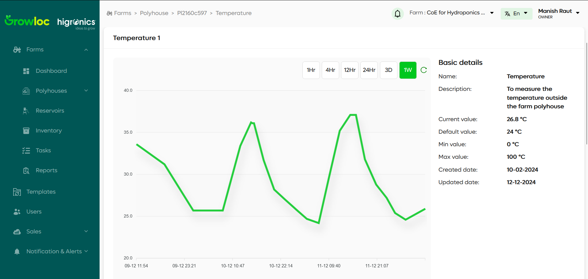

# Sensor Details Page

The **Sensor Details Page** provides an in-depth view of the selected sensor's data over various time intervals. Users can easily access and analyze sensor data across different durations, from 1 hour to 1 week.

## Features

1. **Graph Display**:
   - The graph displays real-time data from the selected sensor.
2. **Data Duration Selection**:

   - The following buttons are available to adjust the data duration on the graph:
     - **1 Hour**
     - **4 Hours**
     - **12 Hours**
     - **24 Hours**
     - **3 Days**
     - **1 Week**

3. **Sensor Information**:
   - The sensor information section displays the following details:
     - **Name**: The name of the sensor (e.g., Temperature Sensor).
     - **Description**: Information about the sensor, such as its location and behavior.
     - **Current Value**: The latest recorded value from the sensor.
     - **Default Value**: The default value for the sensor (if applicable).
     - **Min Value**: The minimum value the sensor can record.
     - **Max Value**: The maximum value the sensor can record.
     - **Created Date**: The date when the sensor was created.
     - **Updated Date**: The last date when the sensor's data was updated.

## Step-by-Step Instructions

### Accessing Sensor Details

1. Navigate to the **Polyhouse Details Page**.
2. Click on a sensor (e.g., **Temperature Sensor**) to open its details page.

### Viewing Sensor Data

1. On the **Sensor Details Page**, you will see a graph representing the sensor's data.
2. To adjust the time duration of the data shown:
   - Click one of the available time duration buttons (**1 Hour**, **4 Hours**, **12 Hours**, **24 Hours**, **3 Days**, or **1 Week**).
3. The graph will update to reflect the data for the selected duration.

   

### Troubleshooting

- **Issue**: Data does not change when selecting a new duration.
- **Solution**: Ensure the sensor has collected sufficient data for the selected time frame. Refresh the page if the issue persists.

---
