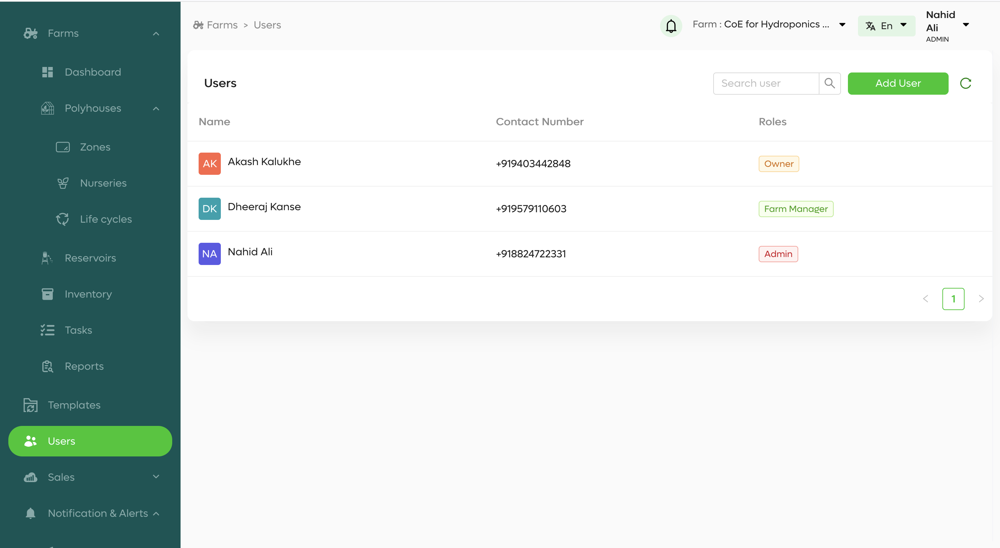

# User Management

## Introduction

The User Management feature allows you to manage all the users who have access to the farm management system. You can add new users, view user details, and assign roles to users.

## Features

- **View Users**: See a list of all users with their contact numbers and roles.
- **Add User**: Add a new user to the system.
- **Search User**: Search for a user by name or contact number.
- **Assign Roles**: Assign roles such as Farm Manager, Owner, or Admin to users.

### User List

The user list shows the name, contact number, and role of each user.

### Add User

Click the "Add User" button to open a form where you can enter the details of a new user.

## Screenshots

