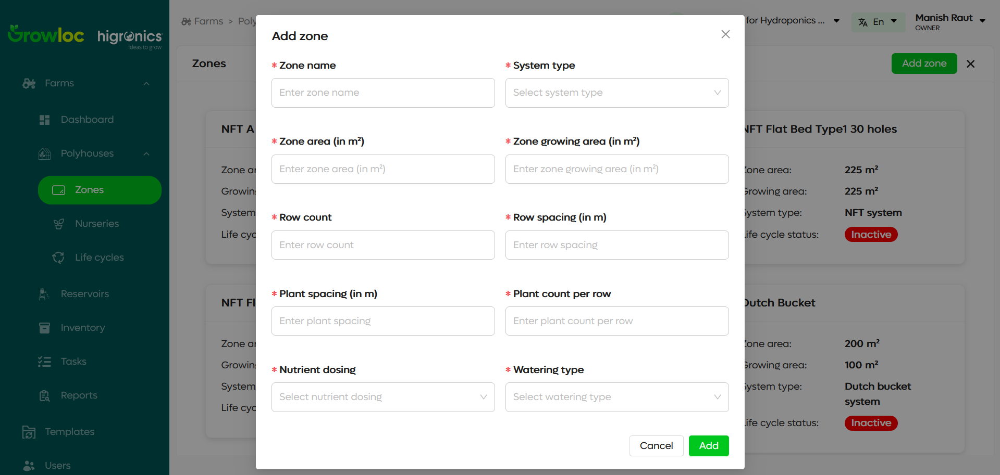

# Zone Page Documentation

The **Zone Page** provides a comprehensive interface for managing zones within a polyhouse. Zones are distinct areas within a polyhouse, designed for specific purposes such as plant growth. This page allows users to view, add, and manage zones in a card view and navigate to detailed pages for each zone to access advanced features.

---

## Introduction

Zones in a polyhouse are pivotal for organizing and managing plant growth systematically. The **Zone Page** offers an intuitive UI for zone management, enabling users to:

- View all zones in card format.
- Access detailed information and tabs for sensors, components, and tasks.
- Manually update data when necessary.
- Perform CRUD operations like deleting zones.

---

## Features

### 1. Zone Overview (Card View)

- Displays zones in a card layout for a quick summary.
- Each card includes:
  - Zone Name (e.g., **NFT A Shape**).
  - Zone Area (e.g., **200 m²**).
  - Growing Area (e.g., **150 m²**).
  - System Type (e.g., **NFT System**, **Dutch Bucket**).
  - Life Cycle Status (e.g., **Active**, **Inactive**).

### 2. Add Zone

- A prominent **Add Zone** button allows users to create a new zone.

### 3. Zone Details Page

- Accessed by clicking on a zone card.
- Displays:
  - Zone information.
  - Tabs for **Sensors**, **Components**, and **Tasks**.
  - Options for manual data entry.
  - A three-dot menu for additional actions like deleting the zone.

### 4. Manual Data Entry

- Allows users to update specific metrics manually if automated updates are unavailable.

### 5. Three-Dot Menu Options

- Provides a delete option for removing zones.

---

## Step-by-Step Instructions

### 1. Viewing Zones

1. Navigate to the **Zone Page** from the sidebar.
2. View a list of zones displayed as cards.
3. Each card displays:
   - Zone Name
   - Zone Area and Growing Area
   - System Type
   - Life Cycle Status (e.g., Active/Inactive).

### 2. Adding a New Zone

1. Click the **Add Zone** button in the top-right corner.
2. Fill in the required fields:
   - Zone Name
   - Zone Area
   - Growing Area
   - System Type
     and other details
3. Click **Add** to add the new zone.
4. The newly created zone appears in the list.

### 3. Viewing Zone Details

1. Click on a zone card to open its **Zone Details Page**.
2. View detailed metrics:
   - Total Zone Area
   - Growing Area Utilization (%)
   - System Type
   - Active Life Cycles
3. Use the **Sensors**, **Components**, and **Tasks** tabs to manage respective zone aspects.

### 4. Managing Sensors

1. Navigate to the **Sensors Tab**.
2. View live data for metrics like:
   - Electrical Conductivity (EC)
   - pH Levels
3. Update sensor data manually if needed using the **Manual Entry** button.

### 5. Managing Components

1. Go to the **Components Tab**.
2. View installed components like irrigation systems, lighting, etc.

### 6. Managing Tasks

1. Open the **Tasks Tab**.
2. Add, update, or delete tasks associated with the zone.

### 7. Manual Data Entry

1. On the Zone Details Page, click **Manual Entry**.
2. Input specific values for:
   - Sensor readings
   - Zone utilization metrics
3. Save the changes to update the zone information.

### 8. Deleting a Zone

1. On the Zone Details Page, click the **three-dot menu** in the top-right corner.
2. Select **Delete Zone**.
3. Confirm the action to remove the zone permanently.

---

## Troubleshooting

1. **Unable to Add Zone**:

   - Verify all required fields are filled.
   - Check for error messages next to invalid fields.

2. **Sensor Data Not Updating**:

   - Ensure sensors are connected and functional.
   - Use the **Manual Entry** option as a temporary measure.

3. **Error in Deleting Zone**:

   - Check if the zone is associated with active life cycles or tasks.
   - Resolve dependencies before deletion.

4. **Zone Details Not Loading**:
   - Refresh the page or ensure stable internet connectivity.

---
